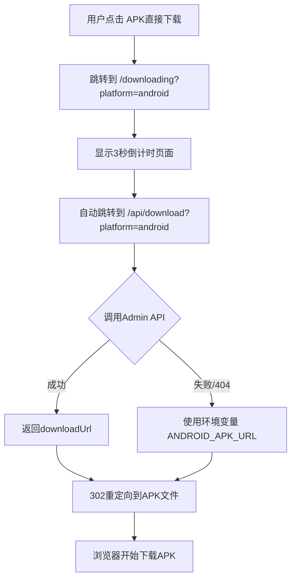

# 下载流程验证文档

## ✅ 当前配置状态

### 1. 环境变量配置 (.env.local)

```env
NEXT_PUBLIC_SITE_DOMAIN="localhost:3003"
ADMIN_API_URL="https://adminseohub.xyz"
ANDROID_APK_URL="https://bsuvzqihxbgoclfvgbhx.supabase.co/storage/v1/object/public/downloads/Telegram.apk"
```

### 2. 按钮优化完成

在 `app/page.tsx` 中,Android下载按钮已优化:

**主要按钮 (APK直接下载)**:
- ✅ 绿色背景,更醒目
- ✅ 下载图标
- ✅ 显示 "（推荐）无需Google服务"
- ✅ 链接到: `/downloading?platform=android`

**次要按钮 (Google Play)**:
- ✅ 白色背景+边框
- ✅ 链接到: Google Play Store

### 3. 下载流程



### 4. API路由逻辑 (app/api/download/route.ts)

```typescript
try {
  // 1. 尝试从Admin API获取
  const apiUrl = `${ADMIN_API_URL}/api/public/download-config?domain=${SITE_DOMAIN}&platform=android`
  const response = await fetch(apiUrl)
  const config = await response.json()

  // 2. 使用API返回的downloadUrl
  return NextResponse.redirect(config.downloadUrl, 302)

} catch (error) {
  // 3. 失败时使用环境变量作为后备
  const fallbackUrl = process.env.ANDROID_APK_URL
  if (fallbackUrl) {
    return NextResponse.redirect(fallbackUrl, 302)  // ✅ 直接下载APK
  }
}
```

---

## 🎯 工作模式

### 模式1: Admin API可用 (推荐)

**前提条件**:
- ✅ Admin后台已部署在 `https://adminseohub.xyz`
- ✅ 已在后台添加下载配置 (Downloads管理页面)

**流程**:
1. 用户点击下载 → 3秒倒计时 → 调用API
2. API从Admin后台获取 `downloadUrl`
3. 重定向到Supabase APK文件
4. 浏览器下载APK

**优势**:
- 可以随时在Admin后台更新下载链接
- 支持版本管理
- 可以切换不同的APK文件
- 统计下载次数

### 模式2: 环境变量后备 (当前可用)

**前提条件**:
- ✅ `.env.local` 中已设置 `ANDROID_APK_URL`

**流程**:
1. 用户点击下载 → 3秒倒计时 → 调用API
2. Admin API调用失败
3. 使用环境变量中的URL作为后备
4. 重定向到: `https://bsuvzqihxbgoclfvgbhx.supabase.co/storage/v1/object/public/downloads/Telegram.apk`
5. 浏览器下载APK

**优势**:
- 即使Admin API不可用,下载仍然正常工作
- 部署简单,无需配置数据库

---

## 🧪 测试验证

### 本地测试

```bash
# 1. 启动开发服务器
cd /home/ubuntu/WebstormProjects/telegram-download-site
npm run dev

# 2. 访问下载页
http://localhost:3003

# 3. 点击 "APK 直接下载" 按钮

# 4. 观察流程:
#    - 进入倒计时页面 (3秒)
#    - 自动跳转到 /api/download?platform=android
#    - 如果Admin API可用,使用API链接
#    - 如果API不可用,使用环境变量 ANDROID_APK_URL
#    - 浏览器开始下载 Telegram.apk
```

### 生产环境测试

部署到Netlify后:

```bash
# 1. 访问Netlify URL
https://你的站点名.netlify.app

# 2. 点击下载按钮

# 3. 检查浏览器网络面板:
#    - /downloading?platform=android (200 OK)
#    - /api/download?platform=android (302 Found)
#    - Location: https://bsuvzqihxbgoclfvgbhx.supabase.co/storage/v1/object/public/downloads/Telegram.apk
#    - Telegram.apk (下载开始)
```

---

## 🔧 Admin后台配置 (可选,推荐)

### 在Admin后台添加下载配置

1. **登录Admin后台**
   - 访问: https://adminseohub.xyz
   - 使用你的管理员账号登录

2. **进入下载管理页面**
   - 左侧菜单 → 📥 **下载管理**

3. **添加Android配置**
   - 点击 "添加下载配置"
   - 填写表单:
     - **网站**: 选择你的下载站点 (domain: `你的netlify域名.netlify.app`)
     - **平台**: Android
     - **下载链接**: `https://bsuvzqihxbgoclfvgbhx.supabase.co/storage/v1/object/public/downloads/Telegram.apk`
     - **商店链接**: `https://play.google.com/store/apps/details?id=org.telegram.messenger`
     - **版本号**: 10.5.2
     - **发布日期**: 选择日期
     - **文件大小**: 例如 "56.8 MB"
     - **最低系统版本**: 例如 "Android 6.0+"
     - **状态**: ACTIVE
     - **设为默认**: ✅ 勾选
   - 点击 "创建"

4. **测试API**
   - 访问: `https://adminseohub.xyz/api/public/download-config?domain=你的域名&platform=android`
   - 应该返回JSON配置数据

配置完成后,下载站点会自动使用Admin API的配置,而不是环境变量。

---

## 📊 两种模式对比

| 特性 | 环境变量模式 | Admin API模式 |
|------|-------------|--------------|
| 配置难度 | ⭐ 简单 | ⭐⭐⭐ 需要配置后台 |
| 更新链接 | 需要重新部署 | 后台直接修改 |
| 版本管理 | ❌ 不支持 | ✅ 支持 |
| 下载统计 | ❌ 不支持 | ✅ 支持 |
| 多平台支持 | 需要多个环境变量 | ✅ 统一管理 |
| 可靠性 | ✅ 简单可靠 | ✅ 有环境变量作为后备 |

---

## ✅ 当前状态总结

1. **按钮优化**: ✅ 完成
   - APK下载是主要按钮 (绿色,带图标)
   - Google Play是次要按钮

2. **下载流程**: ✅ 完成
   - 用户体验: 点击 → 倒计时3秒 → 下载
   - 后端逻辑: API优先 → 环境变量后备

3. **环境变量**: ✅ 已配置
   - `ANDROID_APK_URL` 指向Supabase APK文件

4. **API路由**: ✅ 完成
   - 支持Admin API集成
   - 支持环境变量后备

5. **部署就绪**: ⚠️ 需要修复Netlify设置
   - 参考: `NETLIFY-DEPLOYMENT-FIX.md`

---

## 🚀 下一步行动

### 必须完成 (否则无法访问)

1. **修复Netlify部署设置**
   - 按照 `NETLIFY-DEPLOYMENT-FIX.md` 操作
   - 清空 Base directory
   - 重新部署

### 可选 (提升功能)

2. **部署Admin后台到宝塔**
   - 按照 `BAOTA-DEPLOYMENT.md` 操作
   - 完成后可以动态管理下载链接

3. **在Admin后台配置下载数据**
   - 登录后台 → 下载管理 → 添加配置
   - 完成后下载页会使用API数据而不是环境变量

---

生成时间: 2025-11-23
当前模式: **环境变量后备模式** (可立即使用)
